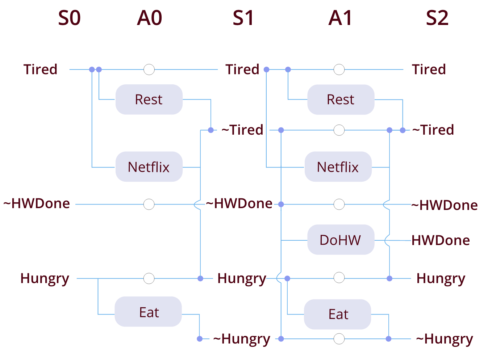
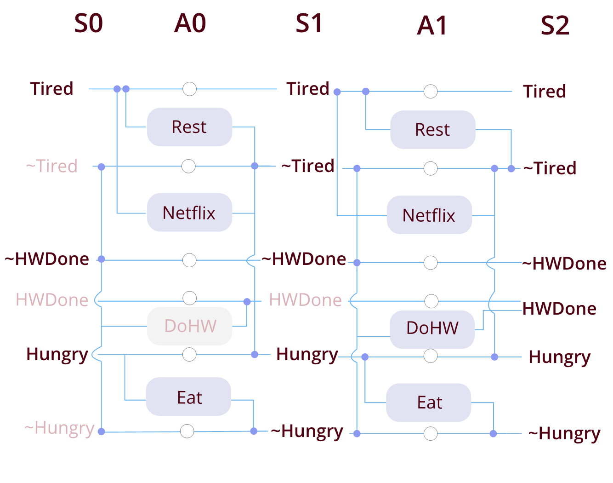

Hi everyone,
We've gotten a few questions about question 1.7 on the homework. It's certainly a challenging one, so we wanted to provide you a bit more of the theoretical understanding you might find useful to tackle the question.

First, a quick review of what we're trying to do here and how mutexes fit into the picture.

## What exactly are we trying to do here? A high level overview
Our goal state is a conjunction of literals (can be negated or not), for example, the goal state *HomeworkDone*.  We start at some initial state, and we want to figure out how to get to our goal state with the fewest number of actions, and with the most generality in our ordering. What is "generality in our ordering"?  We want to find a plan that achieves our goal, but we want to find more than just any old plan that tells us *what order we have to do some actions in*.  We want to find a plan that also tells us which actions (if any) *do not have any ordering constraints between them*.

For example, instead of finding this plan,

*Rest* -> *Eat* -> *Do Homework* -> Goal

we might find this plan, where we realize that we have to rest and eat before doing our homework, but we can *Rest* then *Eat* or *Eat* then *Rest*.  The important thing is that we're not sprinkling cold water on our faces or listening to our stomachs growl in the UGLI.  We would find this plan:

(*Rest*, *Eat*) -> *Do Homework* -> Goal

How do we find that?  This is the purpose of the algorithm **graphplan**.  As you can imagine, since we're concerned with finding actions that can happen in any order, we need to define conditions that would make it imposssible for actions to happen in any order.  This is the idea of **mutex links**.  We define mutex links over pairs of state literals as well, because if actions cannot happen in any order, then we know that state literals cannot happen in any order as well.

## Mutex Links
**Mutexes between state literals**:
* inconsistent support: actions leading to state A are mutex with all actions leading to state B
* negated literals: A, \~ A

**Mutexes between actions**:
* inconsistent effects: two actions lead to state literals that are a negation of each other
* interference: one action "clobbers" the precondition for another action
* competing needs: actions depend on preconditions which are mutex with each other

## The New Stuff
Everything above this point should be review.  Now, to the portions of the theory that will be most helpful as you contemplate problem 1.7.  Imagine the following graph:

**Goal State**: HWDone

**Initial State**: Hungry and Tired and \~HWDone

**Actions**:\
*Netflix*():\
    Precond: Tired\
    Effects: \~Tired and Hungry (you only watch cooking shows)

*Rest*():\
    Precond: Tired\
    Effects: \~Tired

*Eat*():\
    Precond: Hungry\
    Effects: \~Hungry

**Mutexes**:\
*S0*: none (question to consider: can there ever be mutexes at S0?)

*A0*:\
Rest, P[Tired] - interference, inconsistent effects\
Rest, Netflix - interference\
Netflix, P[Tired] - interference, inconsistent effects\
Netflix, Eat - inconsistent effects\
Eat, P[Hungry]

*S1*:\
Tired, \~Tired - negated literals, inconsistent support\
H, \~H - negated literals

*A1*:\
Rest, P[Tired] - interference, inconsistent effects\
Rest, Netflix - interference\
Netflix, P[Tired] - interference, inconsistent effects\
Netflix, Eat - inconsistent effects

**Now to the core idea**: though we only draw literals and actions that are relevant to our planning process, they still exist (even though they may not be reachable at this level), and should be considered to have mutexes with everything (the intuition behind this is that if they cannot be taken at all, they cannot be taken in any order with another action).  What does it mean for something to be "reachable"?  That is essentially what we have been drawing in our graphs so far - only the states and actions we can possibly take at any given level.

In this graph, there would be the following hidden mutexes:\
*S0*\
HWDone, \~HWDone\
Tired, \~Tired\
Hungry, \~Hungry

*A0*\
DoHW, P[\~HWDone]\
DoHW, P[HWDone]\
DoHW, P[Tired]\
DoHW, Eat\
...

As we proceed from A0 to A1 to A2...more actions will become reachable, and where actions that were previously unreachable were mutex with everything, now they will only be mutex with those actions they have a conflict with.  Actions A1 and A2 in any level that are mutex due to inconsistent effects or interference will always be mutex, but the number actions mutex because of competing needs may decrease because they rely on their preconditions being mutex.  Preconditions are states, which can be mutex because of negated literals (which will be constant across all levels) or inconsistent support, where all actions that achieve this goal are mutex.  But since we know that we have an increasing amount of available actions, we must have a monotonically decreasing amount of state mutexes due to inconsistent support, which means we must have a decreasing amount of mutexes at each action level.

To be clear: on any homework or exam, you only need to show us the mutexes that are reachable.  These concepts are important to understand for the theory of how the graph hangs together, but when asked to write out mutexes we will only ask about reachable ones.

With this in mind, think about the following questions (#4 is your homework question).  Come to OH or discussion if you'd like to go over them!
1. Does the number of visible state literals increase or decrease from state level to state level? (i.e. S0 to S1 to S2...)
2. Does the number of visible actions increase or decrease from action level to action level?
3. Does the number of mutexes increase or decrease from action level to the next action level?  
4. Does the number of mutexes increase or decrease from state level to state level?
5. Does the set of no-goods increase or decrease from state level to state level?
